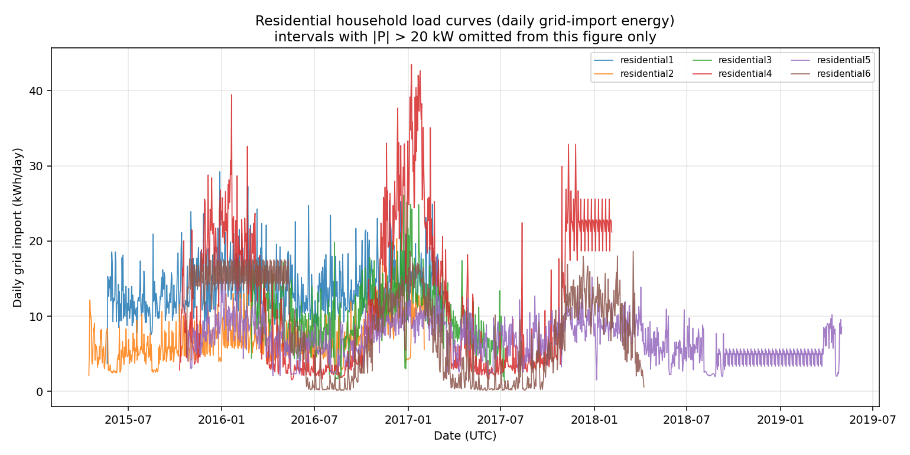
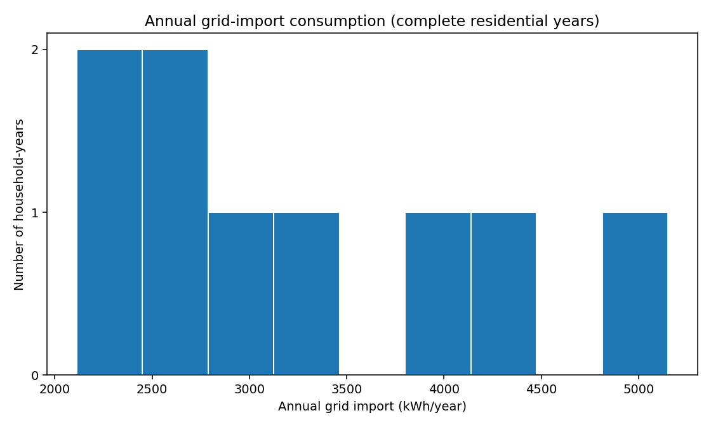
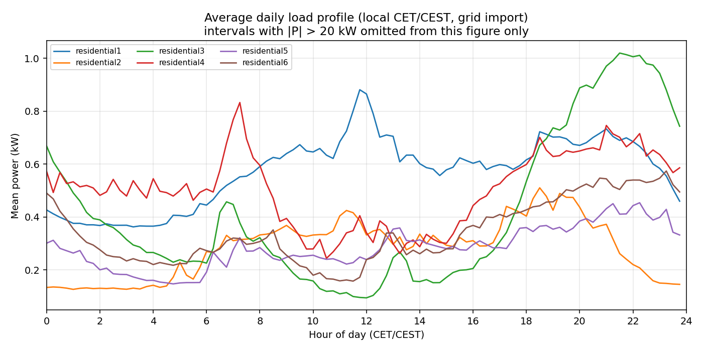
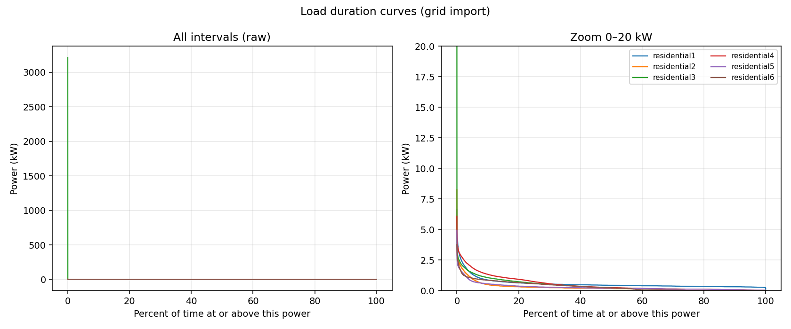

# OPSD household data — inspection overview

Read-only inspection of the local Open Power System Data (OPSD) package.
Raw files were not modified, converted, copied, or filtered.
No representative profiles, benchmark cohorts, or application code were created.

## Dataset

Local files under `research/opsd/raw/`:

| File | Size | Role |
| --- | ---: | --- |
| `household_data_15min_singleindex.csv` | 60.5 MB | 15-minute wide CSV (Part 1) |
| `household_data.sqlite` | 1168.9 MB | 1 / 15 / 60-minute SQLite (Part 2) |

Package identity (from OPSD documentation matching these files):

- **Title:** Data Package Household Data
- **Publisher:** Open Power System Data
- **Version matching this content:** 2020-04-15
- **URL:** https://data.open-power-system-data.org/household_data/2020-04-15/
- **Primary project:** CoSSMic (ISC Konstanz trial site)
- **Geography:** Konstanz, southern Germany
- **Units:** cumulative energy in **kWh** as recorded by MID-certified meters, not instantaneous power
- **Gap handling (publisher):** linear interpolation or fill from prior days; flagged in `interpolated`

Load-curve plots and interval statistics below convert cumulative kWh to interval energy (`ΔkWh`) and mean power (`ΔkWh / 0.25 h`) **in memory only**.

---

## Part 1 — CSV (`household_data_15min_singleindex.csv`)

### Headline facts

| Item | Value |
| --- | --- |
| Total data rows | 153,810 |
| Column count | 71 |
| First UTC timestamp | 2014-12-11T17:45:00Z |
| Last UTC timestamp | 2019-05-01T22:00:00Z |
| Dataset time span | 2014-12-11 17:45:00Z → 2019-05-01 22:00:00Z (~1602.2 days) |
| Sampling interval | 900 s (15 minutes); 0 non-900 s steps among 153,809 diffs |
| Unique UTC timestamps | 153,810 |
| Duplicated timestamps | 0 |
| Unique sites in column names | 11 (6 residential, 3 industrial, 2 public) |
| Unique **residential households** | **6** |

Observed timestamp step sizes (seconds): 900

### Column names

Wide / single-index layout: one shared time axis, one column per meter feed.

| # | Column |
| ---: | --- |
| 1 | `utc_timestamp` |
| 2 | `cet_cest_timestamp` |
| 3 | `DE_KN_industrial1_grid_import` |
| 4 | `DE_KN_industrial1_pv_1` |
| 5 | `DE_KN_industrial1_pv_2` |
| 6 | `DE_KN_industrial2_grid_import` |
| 7 | `DE_KN_industrial2_pv` |
| 8 | `DE_KN_industrial2_storage_charge` |
| 9 | `DE_KN_industrial2_storage_decharge` |
| 10 | `DE_KN_industrial3_area_offices` |
| 11 | `DE_KN_industrial3_area_room_1` |
| 12 | `DE_KN_industrial3_area_room_2` |
| 13 | `DE_KN_industrial3_area_room_3` |
| 14 | `DE_KN_industrial3_area_room_4` |
| 15 | `DE_KN_industrial3_compressor` |
| 16 | `DE_KN_industrial3_cooling_aggregate` |
| 17 | `DE_KN_industrial3_cooling_pumps` |
| 18 | `DE_KN_industrial3_dishwasher` |
| 19 | `DE_KN_industrial3_ev` |
| 20 | `DE_KN_industrial3_grid_import` |
| 21 | `DE_KN_industrial3_machine_1` |
| 22 | `DE_KN_industrial3_machine_2` |
| 23 | `DE_KN_industrial3_machine_3` |
| 24 | `DE_KN_industrial3_machine_4` |
| 25 | `DE_KN_industrial3_machine_5` |
| 26 | `DE_KN_industrial3_pv_facade` |
| 27 | `DE_KN_industrial3_pv_roof` |
| 28 | `DE_KN_industrial3_refrigerator` |
| 29 | `DE_KN_industrial3_ventilation` |
| 30 | `DE_KN_public1_grid_import` |
| 31 | `DE_KN_public2_grid_import` |
| 32 | `DE_KN_residential1_dishwasher` |
| 33 | `DE_KN_residential1_freezer` |
| 34 | `DE_KN_residential1_grid_import` |
| 35 | `DE_KN_residential1_heat_pump` |
| 36 | `DE_KN_residential1_pv` |
| 37 | `DE_KN_residential1_washing_machine` |
| 38 | `DE_KN_residential2_circulation_pump` |
| 39 | `DE_KN_residential2_dishwasher` |
| 40 | `DE_KN_residential2_freezer` |
| 41 | `DE_KN_residential2_grid_import` |
| 42 | `DE_KN_residential2_washing_machine` |
| 43 | `DE_KN_residential3_circulation_pump` |
| 44 | `DE_KN_residential3_dishwasher` |
| 45 | `DE_KN_residential3_freezer` |
| 46 | `DE_KN_residential3_grid_export` |
| 47 | `DE_KN_residential3_grid_import` |
| 48 | `DE_KN_residential3_pv` |
| 49 | `DE_KN_residential3_refrigerator` |
| 50 | `DE_KN_residential3_washing_machine` |
| 51 | `DE_KN_residential4_dishwasher` |
| 52 | `DE_KN_residential4_ev` |
| 53 | `DE_KN_residential4_freezer` |
| 54 | `DE_KN_residential4_grid_export` |
| 55 | `DE_KN_residential4_grid_import` |
| 56 | `DE_KN_residential4_heat_pump` |
| 57 | `DE_KN_residential4_pv` |
| 58 | `DE_KN_residential4_refrigerator` |
| 59 | `DE_KN_residential4_washing_machine` |
| 60 | `DE_KN_residential5_dishwasher` |
| 61 | `DE_KN_residential5_grid_import` |
| 62 | `DE_KN_residential5_refrigerator` |
| 63 | `DE_KN_residential5_washing_machine` |
| 64 | `DE_KN_residential6_circulation_pump` |
| 65 | `DE_KN_residential6_dishwasher` |
| 66 | `DE_KN_residential6_freezer` |
| 67 | `DE_KN_residential6_grid_export` |
| 68 | `DE_KN_residential6_grid_import` |
| 69 | `DE_KN_residential6_pv` |
| 70 | `DE_KN_residential6_washing_machine` |
| 71 | `interpolated` |

### Household / site identifiers

OPSD documents this package as **11 households** in southern Germany. That count includes industrial buildings and two schools. For PVNavigator (residential PV + battery), only the six `residential*` sites are households.

| Site | Kind | Description | Feeds |
| --- | --- | --- | --- |
| `industrial1` | industrial | industrial warehouse | `grid_import`, `pv_1`, `pv_2` |
| `industrial2` | industrial | industrial (crafts sector) | `grid_import`, `pv`, `storage_charge`, `storage_decharge` |
| `industrial3` | industrial | industrial (research institute) | `area_offices`, `area_room_1`, `area_room_2`, `area_room_3`, `area_room_4`, `compressor`, `cooling_aggregate`, `cooling_pumps`, `dishwasher`, `ev`, `grid_import`, `machine_1`, `machine_2`, `machine_3`, `machine_4`, `machine_5`, `pv_facade`, `pv_roof`, `refrigerator`, `ventilation` |
| `public1` | public | school (urban) | `grid_import` |
| `public2` | public | school (urban) | `grid_import` |
| `residential1` | residential | residential building (suburban) | `dishwasher`, `freezer`, `grid_import`, `heat_pump`, `pv`, `washing_machine` |
| `residential2` | residential | residential building (suburban) | `circulation_pump`, `dishwasher`, `freezer`, `grid_import`, `washing_machine` |
| `residential3` | residential | residential building (urban) | `circulation_pump`, `dishwasher`, `freezer`, `grid_export`, `grid_import`, `pv`, `refrigerator`, `washing_machine` |
| `residential4` | residential | residential building (urban) | `dishwasher`, `ev`, `freezer`, `grid_export`, `grid_import`, `heat_pump`, `pv`, `refrigerator`, `washing_machine` |
| `residential5` | residential | residential apartment (urban) | `dishwasher`, `grid_import`, `refrigerator`, `washing_machine` |
| `residential6` | residential | residential building (urban) | `circulation_pump`, `dishwasher`, `freezer`, `grid_export`, `grid_import`, `pv`, `washing_machine` |

Residential identifiers:

- `residential1` — residential building (suburban)
- `residential2` — residential building (suburban)
- `residential3` — residential building (urban)
- `residential4` — residential building (urban)
- `residential5` — residential apartment (urban)
- `residential6` — residential building (urban)

### Shared timestamps

**Yes — all feeds share identical timestamps by construction.** The CSV is wide: a single `utc_timestamp` / `cet_cest_timestamp` pair per row. There is no per-household time index.

Coverage still differs: a cell is empty until that meter appears, and again if the publisher left a gap. So households do **not** share identical *valid* observation windows.

### Duplicated timestamps

No duplicate UTC timestamps. The 15-minute grid is regular (900 s) across all 153,810 rows.

### Missing values

Rows with a non-empty `interpolated` flag: **121,593** (79.1% of rows). This is **not** the share of interpolated energy: a row is flagged if *any* listed meter was filled. Most flags are appliance submeters, not whole-house import.

Most-flagged columns (publisher interpolation / prior-day fill):

| Column | Flagged rows |
| --- | ---: |
| `DE_KN_residential3_dishwasher` | 31,757 |
| `DE_KN_residential2_washing_machine` | 25,477 |
| `DE_KN_residential5_grid_import` | 20,552 |
| `DE_KN_residential1_washing_machine` | 15,381 |
| `DE_KN_residential1_dishwasher` | 12,820 |
| `DE_KN_residential3_washing_machine` | 10,212 |
| `DE_KN_residential1_freezer` | 9,613 |
| `DE_KN_residential3_refrigerator` | 9,416 |
| `DE_KN_residential3_circulation_pump` | 8,732 |
| `DE_KN_residential5_dishwasher` | 8,496 |
| `DE_KN_residential2_circulation_pump` | 8,389 |
| `DE_KN_residential3_freezer` | 7,521 |

Missingness is dominated by **late starts / early ends**, not salt-and-pepper holes:

| Column | Finite samples | Missing | Missing % | First finite UTC | Last finite UTC |
| --- | ---: | ---: | ---: | --- | --- |
| `DE_KN_industrial1_grid_import` | 65,730 | 88,080 | 57.3 | 2015-11-28T05:45:00Z | 2017-10-12T22:00:00Z |
| `DE_KN_industrial1_pv_1` | 69,151 | 84,659 | 55.0 | 2015-10-23T14:15:00Z | 2017-10-12T21:45:00Z |
| `DE_KN_industrial1_pv_2` | 69,151 | 84,659 | 55.0 | 2015-10-23T14:15:00Z | 2017-10-12T21:45:00Z |
| `DE_KN_industrial2_grid_import` | 45,113 | 108,697 | 70.7 | 2016-02-22T02:00:00Z | 2017-06-06T00:00:00Z |
| `DE_KN_industrial2_pv` | 47,998 | 105,812 | 68.8 | 2015-10-23T15:00:00Z | 2017-03-06T14:15:00Z |
| `DE_KN_industrial2_storage_charge` | 39,010 | 114,800 | 74.6 | 2016-04-25T15:45:00Z | 2017-06-06T00:00:00Z |
| `DE_KN_industrial2_storage_decharge` | 39,010 | 114,800 | 74.6 | 2016-04-25T15:45:00Z | 2017-06-06T00:00:00Z |
| `DE_KN_industrial3_area_offices` | 57,437 | 96,373 | 62.7 | 2015-10-15T15:00:00Z | 2017-06-04T22:00:00Z |
| `DE_KN_industrial3_area_room_1` | 57,437 | 96,373 | 62.7 | 2015-10-15T15:00:00Z | 2017-06-04T22:00:00Z |
| `DE_KN_industrial3_area_room_2` | 57,437 | 96,373 | 62.7 | 2015-10-15T15:00:00Z | 2017-06-04T22:00:00Z |
| `DE_KN_industrial3_area_room_3` | 57,440 | 96,370 | 62.7 | 2015-10-15T14:15:00Z | 2017-06-04T22:00:00Z |
| `DE_KN_industrial3_area_room_4` | 57,440 | 96,370 | 62.7 | 2015-10-15T14:15:00Z | 2017-06-04T22:00:00Z |
| `DE_KN_industrial3_compressor` | 57,437 | 96,373 | 62.7 | 2015-10-15T15:00:00Z | 2017-06-04T22:00:00Z |
| `DE_KN_industrial3_cooling_aggregate` | 57,437 | 96,373 | 62.7 | 2015-10-15T15:00:00Z | 2017-06-04T22:00:00Z |
| `DE_KN_industrial3_cooling_pumps` | 57,437 | 96,373 | 62.7 | 2015-10-15T15:00:00Z | 2017-06-04T22:00:00Z |
| `DE_KN_industrial3_dishwasher` | 57,439 | 96,371 | 62.7 | 2015-10-15T14:30:00Z | 2017-06-04T22:00:00Z |
| `DE_KN_industrial3_ev` | 41,714 | 112,096 | 72.9 | 2016-03-27T09:45:00Z | 2017-06-04T22:00:00Z |
| `DE_KN_industrial3_grid_import` | 46,036 | 107,774 | 70.1 | 2016-02-11T09:15:00Z | 2017-06-04T22:00:00Z |
| `DE_KN_industrial3_machine_1` | 57,437 | 96,373 | 62.7 | 2015-10-15T15:00:00Z | 2017-06-04T22:00:00Z |
| `DE_KN_industrial3_machine_2` | 57,437 | 96,373 | 62.7 | 2015-10-15T15:00:00Z | 2017-06-04T22:00:00Z |
| `DE_KN_industrial3_machine_3` | 57,437 | 96,373 | 62.7 | 2015-10-15T15:00:00Z | 2017-06-04T22:00:00Z |
| `DE_KN_industrial3_machine_4` | 57,440 | 96,370 | 62.7 | 2015-10-15T14:15:00Z | 2017-06-04T22:00:00Z |
| `DE_KN_industrial3_machine_5` | 57,440 | 96,370 | 62.7 | 2015-10-15T14:15:00Z | 2017-06-04T22:00:00Z |
| `DE_KN_industrial3_pv_facade` | 57,437 | 96,373 | 62.7 | 2015-10-15T15:00:00Z | 2017-06-04T22:00:00Z |
| `DE_KN_industrial3_pv_roof` | 57,437 | 96,373 | 62.7 | 2015-10-15T15:00:00Z | 2017-06-04T22:00:00Z |
| `DE_KN_industrial3_refrigerator` | 56,984 | 96,826 | 63.0 | 2015-10-20T08:15:00Z | 2017-06-04T22:00:00Z |
| `DE_KN_industrial3_ventilation` | 57,437 | 96,373 | 62.7 | 2015-10-15T15:00:00Z | 2017-06-04T22:00:00Z |
| `DE_KN_public1_grid_import` | 18,197 | 135,613 | 88.2 | 2016-05-17T10:00:00Z | 2016-11-22T23:00:00Z |
| `DE_KN_public2_grid_import` | 4,491 | 149,319 | 97.1 | 2016-12-01T13:45:00Z | 2017-01-17T08:15:00Z |
| `DE_KN_residential1_dishwasher` | 63,378 | 90,432 | 58.8 | 2015-05-22T13:15:00Z | 2017-03-12T17:30:00Z |
| `DE_KN_residential1_freezer` | 51,580 | 102,230 | 66.5 | 2015-09-22T10:45:00Z | 2017-03-12T17:30:00Z |
| `DE_KN_residential1_grid_import` | 63,487 | 90,323 | 58.7 | 2015-05-21T15:30:00Z | 2017-03-12T23:00:00Z |
| `DE_KN_residential1_heat_pump` | 63,487 | 90,323 | 58.7 | 2015-05-21T15:30:00Z | 2017-03-12T23:00:00Z |
| `DE_KN_residential1_pv` | 63,487 | 90,323 | 58.7 | 2015-05-21T15:30:00Z | 2017-03-12T23:00:00Z |
| `DE_KN_residential1_washing_machine` | 63,381 | 90,429 | 58.8 | 2015-05-22T12:30:00Z | 2017-03-12T17:30:00Z |
| `DE_KN_residential2_circulation_pump` | 79,291 | 74,519 | 48.4 | 2015-04-01T08:00:00Z | 2017-07-05T06:30:00Z |
| `DE_KN_residential2_dishwasher` | 76,530 | 77,280 | 50.2 | 2015-04-10T07:45:00Z | 2017-06-15T12:00:00Z |
| `DE_KN_residential2_freezer` | 41,000 | 112,810 | 73.3 | 2015-04-10T07:45:00Z | 2016-06-10T09:30:00Z |
| `DE_KN_residential2_grid_import` | 63,190 | 90,620 | 58.9 | 2015-04-15T09:15:00Z | 2017-02-01T14:30:00Z |
| `DE_KN_residential2_washing_machine` | 98,929 | 54,881 | 35.7 | 2015-04-10T07:45:00Z | 2018-02-03T19:45:00Z |
| `DE_KN_residential3_circulation_pump` | 132,839 | 20,971 | 13.6 | 2014-12-11T18:00:00Z | 2018-09-25T11:30:00Z |
| `DE_KN_residential3_dishwasher` | 116,384 | 37,426 | 24.3 | 2014-12-11T17:45:00Z | 2018-04-07T01:30:00Z |
| `DE_KN_residential3_freezer` | 114,925 | 38,885 | 25.3 | 2014-12-11T17:45:00Z | 2018-03-22T20:45:00Z |
| `DE_KN_residential3_grid_export` | 90,218 | 63,592 | 41.3 | 2016-02-28T17:15:00Z | 2018-09-25T11:30:00Z |
| `DE_KN_residential3_grid_import` | 47,612 | 106,198 | 69.0 | 2016-02-28T17:15:00Z | 2017-07-08T16:00:00Z |
| `DE_KN_residential3_pv` | 90,218 | 63,592 | 41.3 | 2016-02-28T17:15:00Z | 2018-09-25T11:30:00Z |
| `DE_KN_residential3_refrigerator` | 100,400 | 53,410 | 34.7 | 2014-12-18T19:15:00Z | 2017-10-29T15:00:00Z |
| `DE_KN_residential3_washing_machine` | 122,181 | 31,629 | 20.6 | 2014-12-11T18:00:00Z | 2018-06-06T11:00:00Z |
| `DE_KN_residential4_dishwasher` | 50,477 | 103,333 | 67.2 | 2015-10-13T16:15:00Z | 2017-03-22T11:15:00Z |
| `DE_KN_residential4_ev` | 81,148 | 72,662 | 47.2 | 2015-10-13T16:15:00Z | 2018-02-04T23:00:00Z |
| `DE_KN_residential4_freezer` | 81,147 | 72,663 | 47.2 | 2015-10-13T16:30:00Z | 2018-02-04T23:00:00Z |
| `DE_KN_residential4_grid_export` | 81,435 | 72,375 | 47.1 | 2015-10-10T16:30:00Z | 2018-02-04T23:00:00Z |
| `DE_KN_residential4_grid_import` | 81,435 | 72,375 | 47.1 | 2015-10-10T16:30:00Z | 2018-02-04T23:00:00Z |
| `DE_KN_residential4_heat_pump` | 49,239 | 104,571 | 68.0 | 2015-10-10T16:30:00Z | 2017-03-06T14:00:00Z |
| `DE_KN_residential4_pv` | 81,435 | 72,375 | 47.1 | 2015-10-10T16:30:00Z | 2018-02-04T23:00:00Z |
| `DE_KN_residential4_refrigerator` | 43,053 | 110,757 | 72.0 | 2015-10-14T08:45:00Z | 2017-01-04T19:45:00Z |
| `DE_KN_residential4_washing_machine` | 49,028 | 104,782 | 68.1 | 2015-10-13T16:15:00Z | 2017-03-07T09:00:00Z |
| `DE_KN_residential5_dishwasher` | 94,161 | 59,649 | 38.8 | 2015-10-26T11:30:00Z | 2018-07-03T07:30:00Z |
| `DE_KN_residential5_grid_import` | 123,211 | 30,599 | 19.9 | 2015-10-26T11:30:00Z | 2019-05-01T22:00:00Z |
| `DE_KN_residential5_refrigerator` | 58,254 | 95,556 | 62.1 | 2015-10-26T11:30:00Z | 2017-06-24T06:45:00Z |
| `DE_KN_residential5_washing_machine` | 94,161 | 59,649 | 38.8 | 2015-10-26T11:30:00Z | 2018-07-03T07:30:00Z |
| `DE_KN_residential6_circulation_pump` | 86,133 | 67,677 | 44.0 | 2015-10-24T17:00:00Z | 2018-04-08T22:00:00Z |
| `DE_KN_residential6_dishwasher` | 56,243 | 97,567 | 63.4 | 2015-10-24T16:00:00Z | 2017-06-01T12:30:00Z |
| `DE_KN_residential6_freezer` | 61,383 | 92,427 | 60.1 | 2015-11-30T19:15:00Z | 2017-08-31T04:45:00Z |
| `DE_KN_residential6_grid_export` | 66,755 | 87,055 | 56.6 | 2016-05-13T13:30:00Z | 2018-04-08T22:00:00Z |
| `DE_KN_residential6_grid_import` | 86,133 | 67,677 | 44.0 | 2015-10-24T17:00:00Z | 2018-04-08T22:00:00Z |
| `DE_KN_residential6_pv` | 86,133 | 67,677 | 44.0 | 2015-10-24T17:00:00Z | 2018-04-08T22:00:00Z |
| `DE_KN_residential6_washing_machine` | 59,136 | 94,674 | 61.6 | 2015-10-24T16:00:00Z | 2017-07-01T15:45:00Z |

### Meter jumps / implausible 15-minute power

An interval is flagged here when `|ΔkWh / 0.25 h| > 20 kW` (far above a typical single-family 15-minute mean). These values remain in the raw statistics below; load-curve / daily-profile figures omit them so other houses stay readable.

| Site | n intervals > 20 kW | Largest interval | Power (kW) | UTC |
| --- | ---: | ---: | ---: | --- |
| `residential3` | 1 | 803.940 kWh | 3,215.760 | 2017-07-08T16:00:00Z |

Industrial and school `grid_import` routinely exceed 20 kW; that is expected for those building types and is not treated as a household data-quality issue.

`residential3` has a single ~804 kWh cumulative jump in one 15-minute step (~3,216 kW). That is a meter discontinuity, not household load. It inflates that site’s max, standard deviation, load-duration peak, and one daily total. It is **not** a complete-year household (2016 coverage 84%).

### Complete calendar years

A calendar year is treated as complete when `grid_import` has finite samples for ≥ 99% of the expected 15-minute steps (35040 non-leap, 35136 leap). This is an inspection threshold, not a filter.

**Does every household contain a complete year?** **No.** 5 of 6 residential sites have at least one complete `grid_import` year.

| Site | Complete years (grid import) | Incomplete years |
| --- | --- | --- |
| `industrial1` | 2016 | 2015, 2017 |
| `industrial2` | none | 2016, 2017 |
| `industrial3` | none | 2016, 2017 |
| `public1` | none | 2016 |
| `public2` | none | 2016, 2017 |
| `residential1` | 2016 | 2015, 2017 |
| `residential2` | 2016 | 2015, 2017 |
| `residential3` | none | 2016, 2017 |
| `residential4` | 2016, 2017 | 2015, 2018 |
| `residential5` | 2016, 2017, 2018 | 2015, 2019 |
| `residential6` | 2016, 2017 | 2015, 2018 |

Per-year `grid_import` coverage (residential):

| Site | Year | Finite / expected | Availability % | Complete | Grid-import kWh |
| --- | ---: | ---: | ---: | --- | ---: |
| `residential1` | 2015 | 21,538 / 35,040 | 61.5 | no | 2,912.4 |
| `residential1` | 2016 | 35,136 / 35,136 | 100.0 | yes | 5,151.6 |
| `residential1` | 2017 | 6,813 / 35,040 | 19.4 | no | 1,032.1 |
| `residential2` | 2015 | 25,019 / 35,040 | 71.4 | no | 1,460.7 |
| `residential2` | 2016 | 35,136 / 35,136 | 100.0 | yes | 2,719.2 |
| `residential2` | 2017 | 3,035 / 35,040 | 8.7 | no | 315.4 |
| `residential3` | 2016 | 29,499 / 35,136 | 84.0 | no | 3,079.4 |
| `residential3` | 2017 | 18,113 / 35,040 | 51.7 | no | 2,698.5 |
| `residential4` | 2015 | 7,902 / 35,040 | 22.6 | no | 1,154.0 |
| `residential4` | 2016 | 35,136 / 35,136 | 100.0 | yes | 3,919.5 |
| `residential4` | 2017 | 35,040 / 35,040 | 100.0 | yes | 4,395.9 |
| `residential4` | 2018 | 3,357 / 35,040 | 9.6 | no | 776.5 |
| `residential5` | 2015 | 6,386 / 35,040 | 18.2 | no | 500.1 |
| `residential5` | 2016 | 35,136 / 35,136 | 100.0 | yes | 2,676.6 |
| `residential5` | 2017 | 35,040 / 35,040 | 100.0 | yes | 2,797.5 |
| `residential5` | 2018 | 35,040 / 35,040 | 100.0 | yes | 2,153.3 |
| `residential5` | 2019 | 11,609 / 35,040 | 33.1 | no | 645.5 |
| `residential6` | 2015 | 6,556 / 35,040 | 18.7 | no | 1,037.1 |
| `residential6` | 2016 | 35,136 / 35,136 | 100.0 | yes | 3,298.8 |
| `residential6` | 2017 | 35,040 / 35,040 | 100.0 | yes | 2,112.8 |
| `residential6` | 2018 | 9,401 / 35,040 | 26.8 | no | 899.3 |

### Annual electricity consumption

Primary series: **`grid_import`** (cumulative kWh). Annual energy = last finite reading in the calendar year minus the first finite reading in that year. This uses the cumulative meter property; gaps do not require filling here.

**Caveat:** for sites with PV, `grid_import` is **not** total household electricity. This CSV has no `consumption` column. Where `pv` and `grid_export` both exist, a reconstructed load `grid_import + pv − grid_export` is shown as a diagnostic only.

Complete residential household-years (`grid_import`):

| Site | Year | Annual grid import (kWh) |
| --- | ---: | ---: |
| `residential1` | 2016 | 5,151.6 |
| `residential2` | 2016 | 2,719.2 |
| `residential4` | 2016 | 3,919.5 |
| `residential4` | 2017 | 4,395.9 |
| `residential5` | 2016 | 2,676.6 |
| `residential5` | 2017 | 2,797.5 |
| `residential5` | 2018 | 2,153.3 |
| `residential6` | 2016 | 3,298.8 |
| `residential6` | 2017 | 2,112.8 |

| Statistic | kWh / year |
| --- | ---: |
| n (household-years) | 9 |
| Minimum | 2,112.8 |
| Maximum | 5,151.6 |
| Mean | 3,247.3 |
| Median | 2,797.5 |

Feed totals over each site's full finite span (last − first cumulative reading):

| Site | grid_import kWh | PV kWh | grid_export kWh | heat_pump kWh | EV kWh | Reconstructable load kWh |
| --- | ---: | ---: | ---: | ---: | ---: | ---: |
| `industrial1` | 511,112.2 | — | — | — | — | — |
| `industrial2` | 16,698.7 | 22,122.4 | — | — | — | — |
| `industrial3` | 916,188.9 | — | — | — | 960.4 | — |
| `public1` | 12,313.5 | — | — | — | — | — |
| `public2` | 64,225.2 | — | — | — | — | — |
| `residential1` | 9,096.4 | 16,521.8 | — | 10,213.5 | — | — |
| `residential2` | 4,495.4 | — | — | — | — | — |
| `residential3` | 5,778.1 | 13,673.7 | 9,388.8 | — | — | 10,062.9 |
| `residential4` | 10,247.1 | 24,576.4 | 19,070.8 | 4,728.8 | 2,225.0 | 15,752.8 |
| `residential5` | 8,773.8 | — | — | — | — | — |
| `residential6` | 7,348.3 | 20,495.4 | 3,443.2 | — | — | 24,400.5 |

### Basic statistics for every residential `grid_import` profile

Interval power is `ΔkWh / 0.25 h`. Negative intervals indicate meter resets or corrections. `residential3` max (3,215.8 kW) is the meter jump above, not a real peak.

| Site | Finite intervals | Negative Δ | Span kWh | Mean kW | Median kW | P95 kW | Max kW | Std kW |
| --- | ---: | ---: | ---: | ---: | ---: | ---: | ---: | ---: |
| `residential1` | 63,486 | 0 | 9,096.4 | 0.573 | 0.440 | 1.355 | 6.652 | 0.462 |
| `residential2` | 63,189 | 0 | 4,495.4 | 0.285 | 0.172 | 0.980 | 8.256 | 0.377 |
| `residential3` | 47,611 | 0 | 5,778.1 | 0.485 | 0.240 | 1.460 | 3,215.760 | 14.745 |
| `residential4` | 81,434 | 0 | 10,247.1 | 0.503 | 0.248 | 1.880 | 6.092 | 0.659 |
| `residential5` | 123,210 | 0 | 8,773.8 | 0.285 | 0.200 | 0.760 | 4.940 | 0.303 |
| `residential6` | 86,132 | 0 | 7,348.3 | 0.341 | 0.232 | 1.020 | 3.764 | 0.400 |

Industrial / public `grid_import` (same interval statistics, for completeness):

| Site | Finite intervals | Negative Δ | Span kWh | Mean kW | Median kW | Max kW |
| --- | ---: | ---: | ---: | ---: | ---: | ---: |
| `industrial1` | 65,729 | 0 | 511,112.2 | 31.104 | 27.500 | 163.312 |
| `industrial2` | 45,112 | 0 | 16,698.7 | 1.481 | 1.600 | 11.240 |
| `industrial3` | 46,035 | 0 | 916,188.9 | 79.608 | 62.000 | 366.276 |
| `public1` | 18,196 | 0 | 12,313.5 | 2.707 | 1.444 | 20.452 |
| `public2` | 4,490 | 0 | 64,225.2 | 57.216 | 40.396 | 192.800 |

### Overview figures

Figures use residential `grid_import` only (the six actual households). Daily load curves and the average daily profile omit intervals with `|P| > 20 kW`. The load-duration figure shows raw data (left) and a 0–20 kW zoom (right).

- `load_curves_all_households.png`
- `annual_consumption_histogram.png`
- `daily_average_load_profile.png`
- `load_duration_curves.png`









---

## Part 2 — SQLite (`household_data.sqlite`)

The SQLite file was **not extracted or resampled**. Only schema, row counts,
time-span endpoints, and column names were read.

### Available tables

| Table | Rows | First UTC | Last UTC | Interpolated rows | Duplicate timestamps |
| --- | ---: | --- | --- | ---: | ---: |
| `household_data_15min_singleindex` | 153,810 | 2014-12-11T17:45:00Z | 2019-05-01T22:00:00Z | 121,593 | 0 |
| `household_data_1min_singleindex` | 2,307,133 | 2014-12-11T17:59:00Z | 2019-05-01T22:11:00Z | 1,781,016 | 0 |
| `household_data_60min_singleindex` | 38,454 | 2014-12-11T17:00:00Z | 2019-05-01T22:00:00Z | 31,797 | 0 |

Views: none.

Indexes:

- `ix_household_data_15min_singleindex_utc_timestamp`
- `ix_household_data_1min_singleindex_utc_timestamp`
- `ix_household_data_60min_singleindex_utc_timestamp`

### Database schema

Three parallel wide tables with the **same column layout**, different time resolution:

- `household_data_1min_singleindex` — 1-minute
- `household_data_15min_singleindex` — 15-minute (matches the CSV)
- `household_data_60min_singleindex` — 60-minute

There is **no** separate metadata / household-attribute table, no foreign keys,
and no `sqlite_sequence`. Quality metadata lives in the `interpolated` text column.

Column types on every table:

| Column | SQLite type |
| --- | --- |
| `utc_timestamp` | `TEXT` |
| `cet_cest_timestamp` | `TEXT` |
| `DE_KN_industrial1_grid_import` | `REAL` |
| `DE_KN_industrial1_pv_1` | `REAL` |
| `DE_KN_industrial1_pv_2` | `REAL` |
| `DE_KN_industrial2_grid_import` | `REAL` |
| `DE_KN_industrial2_pv` | `REAL` |
| `DE_KN_industrial2_storage_charge` | `REAL` |
| `DE_KN_industrial2_storage_decharge` | `REAL` |
| `DE_KN_industrial3_area_offices` | `REAL` |
| `DE_KN_industrial3_area_room_1` | `REAL` |
| `DE_KN_industrial3_area_room_2` | `REAL` |
| `DE_KN_industrial3_area_room_3` | `REAL` |
| `DE_KN_industrial3_area_room_4` | `REAL` |
| `DE_KN_industrial3_compressor` | `REAL` |
| `DE_KN_industrial3_cooling_aggregate` | `REAL` |
| `DE_KN_industrial3_cooling_pumps` | `REAL` |
| `DE_KN_industrial3_dishwasher` | `REAL` |
| `DE_KN_industrial3_ev` | `REAL` |
| `DE_KN_industrial3_grid_import` | `REAL` |
| `DE_KN_industrial3_machine_1` | `REAL` |
| `DE_KN_industrial3_machine_2` | `REAL` |
| `DE_KN_industrial3_machine_3` | `REAL` |
| `DE_KN_industrial3_machine_4` | `REAL` |
| `DE_KN_industrial3_machine_5` | `REAL` |
| `DE_KN_industrial3_pv_facade` | `REAL` |
| `DE_KN_industrial3_pv_roof` | `REAL` |
| `DE_KN_industrial3_refrigerator` | `REAL` |
| `DE_KN_industrial3_ventilation` | `REAL` |
| `DE_KN_public1_grid_import` | `REAL` |
| `DE_KN_public2_grid_import` | `REAL` |
| `DE_KN_residential1_dishwasher` | `REAL` |
| `DE_KN_residential1_freezer` | `REAL` |
| `DE_KN_residential1_grid_import` | `REAL` |
| `DE_KN_residential1_heat_pump` | `REAL` |
| `DE_KN_residential1_pv` | `REAL` |
| `DE_KN_residential1_washing_machine` | `REAL` |
| `DE_KN_residential2_circulation_pump` | `REAL` |
| `DE_KN_residential2_dishwasher` | `REAL` |
| `DE_KN_residential2_freezer` | `REAL` |
| `DE_KN_residential2_grid_import` | `REAL` |
| `DE_KN_residential2_washing_machine` | `REAL` |
| `DE_KN_residential3_circulation_pump` | `REAL` |
| `DE_KN_residential3_dishwasher` | `REAL` |
| `DE_KN_residential3_freezer` | `REAL` |
| `DE_KN_residential3_grid_export` | `REAL` |
| `DE_KN_residential3_grid_import` | `REAL` |
| `DE_KN_residential3_pv` | `REAL` |
| `DE_KN_residential3_refrigerator` | `REAL` |
| `DE_KN_residential3_washing_machine` | `REAL` |
| `DE_KN_residential4_dishwasher` | `REAL` |
| `DE_KN_residential4_ev` | `REAL` |
| `DE_KN_residential4_freezer` | `REAL` |
| `DE_KN_residential4_grid_export` | `REAL` |
| `DE_KN_residential4_grid_import` | `REAL` |
| `DE_KN_residential4_heat_pump` | `REAL` |
| `DE_KN_residential4_pv` | `REAL` |
| `DE_KN_residential4_refrigerator` | `REAL` |
| `DE_KN_residential4_washing_machine` | `REAL` |
| `DE_KN_residential5_dishwasher` | `REAL` |
| `DE_KN_residential5_grid_import` | `REAL` |
| `DE_KN_residential5_refrigerator` | `REAL` |
| `DE_KN_residential5_washing_machine` | `REAL` |
| `DE_KN_residential6_circulation_pump` | `REAL` |
| `DE_KN_residential6_dishwasher` | `REAL` |
| `DE_KN_residential6_freezer` | `REAL` |
| `DE_KN_residential6_grid_export` | `REAL` |
| `DE_KN_residential6_grid_import` | `REAL` |
| `DE_KN_residential6_pv` | `REAL` |
| `DE_KN_residential6_washing_machine` | `REAL` |
| `interpolated` | `TEXT` |

### Available columns vs CSV

15-minute SQLite columns identical to CSV header: **yes**.
15-minute row count matches CSV (153,810): **yes**.
15-minute first/last UTC match CSV: **yes**.

### EV charging data

**Yes.** EV columns:

- `DE_KN_industrial3_ev`
- `DE_KN_residential4_ev`

`residential4_ev` is the only **residential** EV charger. `industrial3_ev` is a research-institute EV feed, not a household.

### Heat pump data

**Yes.** Heat pump columns:

- `DE_KN_residential1_heat_pump`
- `DE_KN_residential4_heat_pump`

Two residential heat pumps: `residential1` and `residential4`.

### PV generation

**Yes.** PV columns:

- `DE_KN_industrial1_pv_1`
- `DE_KN_industrial1_pv_2`
- `DE_KN_industrial2_pv`
- `DE_KN_industrial3_pv_facade`
- `DE_KN_industrial3_pv_roof`
- `DE_KN_residential1_pv`
- `DE_KN_residential3_pv`
- `DE_KN_residential4_pv`
- `DE_KN_residential6_pv`

Residential PV: `residential1`, `residential3`, `residential4`, `residential6`. `residential2` and `residential5` have no PV column.

### Battery storage

**Yes, but not in a residential household.** Columns:

- `DE_KN_industrial2_storage_charge`
- `DE_KN_industrial2_storage_decharge`

Battery charge / discharge exists only on **industrial2** (crafts-sector building). No residential battery meter is present.

### Available metadata

Present in the database:

- `utc_timestamp`, `cet_cest_timestamp`
- `interpolated` — publisher gap-fill marker (pipe-separated column names)
- per-feed cumulative kWh series

**Not** present:

- household floor area, occupancy, tariff, or building fabric
- heat-pump rated power, COP, or heat-source type
- EV charger rated power or vehicle model
- PV kWp, tilt, azimuth
- battery usable capacity
- coordinates (Konstanz is documented at package level, not as a table)
- a separate 15-minute-vs-CSV provenance table

### Relationship between SQLite and the CSV

The CSV is the **15-minute single-index extract** of the same CoSSMic / OPSD package.
The SQLite file is a **multi-resolution container** of the same wide schema:

| Aspect | CSV | SQLite |
| --- | --- | --- |
| 15-minute table | the whole file | `household_data_15min_singleindex` |
| 15-minute rows | 153,810 | 153,810 |
| Columns | 71 | same 71 on all three tables |
| Time span (15 min) | 2014-12-11T17:45:00Z → 2019-05-01T22:00:00Z | same |
| 1-minute data | not in this CSV | `household_data_1min_singleindex` (2,307,133 rows) |
| 60-minute data | not in this CSV | `household_data_60min_singleindex` (38,454 rows) |
| File size | ~58 MB | ~1.1 GB (dominated by 1-minute) |

1-minute and 60-minute tables were **not** processed. They exist, they share the same feeds, and their endpoint timestamps sit on the same campaign window (2014-12-11 → 2019-05-01).

---

## Final assessment

### How many unique households are actually available?

**6 unique residential households** (`residential1` … `residential6`).

The package contains **11 sites** in total (6 residential, 3 industrial, 2 public/school). OPSD’s “11 households” wording counts all of them.

5 of the 6 residential sites have at least one calendar year with ≥99% `grid_import` coverage. The campaign window is 2014-12-11 to 2019-05-01; 2014 and 2019 are partial for everyone.

### Suitability for validating PVNavigator recommendations

**Not as a primary validation cohort, and not as a drop-in replacement for WPuQ.** Useful later as a *complementary* research set for EV, appliance-level, and multi-year checks.

Reasons it is weak for SpeicherGrenze / BDEW-style recommendation validation today:

1. **Sample size.** Six homes cannot support a distributional check of Eigenverbrauch, Autarkie, or technical Speichergrenze. WPuQ Phase 2 already uses 27 complete 2019 NO_PV houses.
2. **Meter meaning.** Four of six homes have PV. `grid_import` is then not household demand. WPuQ keeps HOUSEHOLD vs HEATPUMP separate and publishes a corrected `P_TOT` for WITH_PV houses. This OPSD CSV has no equivalent `consumption` feed.
3. **Mixed end uses on the same import meter.** `residential1` and `residential4` have heat pumps; `residential4` also has EV charging. Without a clean residual household series, a recommendation model that already adds HP/EV on top of BDEW would double-count if fed raw `grid_import`.
4. **No residential battery measurements.** Storage exists only on industrial2.
5. **Geography.** Konstanz (south) vs WPuQ (Hamelin district). Weather, HP load, and occupancy patterns are not interchangeable with the current validation climate.
6. **Publisher gap filling.** Interpolated / prior-day fills are already in the released series. Fine for energy totals; less fine if 15-minute shape is treated as fully measured.
7. **One serious meter jump.** `residential3` has an ~804 kWh / 3,216 kW single-interval discontinuity. That house also has no complete calendar year.

Where it *is* suitable, after a later dedicated research phase:

- qualitative / case-study checks on **EV charging shape** (`residential4`)
- heat-pump case studies (`residential1`, `residential4`) against the production HP model
- multi-year stability of the same home (WPuQ is effectively 2019-centred for COMPLETE years)
- 1-minute resolution from SQLite (not used here) for peak / cycling diagnostics
- the two **cleanest household-only** series: `residential2` (no PV, no HP, 2016 complete) and `residential5` (apartment, no PV, 2016–2018 complete)

### How OPSD differs from the existing WPuQ dataset

| | OPSD (this package) | WPuQ (local research set) |
| --- | --- | --- |
| Sites | 6 residential + 3 industrial + 2 schools | 38 single-family houses |
| Location | Konstanz | WPuQ district (Hamelin vicinity) |
| Years in file | 2014-12 → 2019-05 | 2018, 2019, 2020 (calendar files) |
| Best full years | several 2015–2018 windows, site-dependent | 2019 COMPLETE (~30 HH + 30 HP) |
| Resolution here | 15 min CSV; 1 / 15 / 60 min in SQLite | 15 min HDF5 (Phase 1 scope) |
| Physical quantity | cumulative kWh | instantaneous power W (`P_TOT`) |
| Household vs HP | HP is a submeter; HH demand not cleanly split | separate HOUSEHOLD and HEATPUMP tables |
| PV handling | PV as extra cumulative feed; import still contaminated | NO_PV vs WITH_PV groups; corrected `P_TOT` |
| EV | yes (`residential4`, industrial3) | not in the 15-min SFH tables used so far |
| Battery | industrial2 only | none in the SFH 15-min tables |
| Appliance submeters | dishwasher, washing machine, fridge, freezer, … | not used in Phase 1–3 |
| Production role | none (inspection only) | research/validation only; production stays BDEW H25 |
| 2019 NO_PV COMPLETE annual HH demand | n/a (different meter definition) | min 1,146 kWh, median 3,058 kWh, max 5,489 kWh (n=27) |

### Advantages OPSD could provide in future

- **EV charging:** a measured residential EV series (`residential4_ev`), which WPuQ does not provide in the current 15-minute SFH extracts. Relevant once PVNavigator EV logic needs a real charging shape rather than a synthetic block.
- **Heat pumps on a different climate and building stock:** two HP feeds in Konstanz vs ~30 WPuQ HPs in Lower Saxony — a second climate for the HP model, not a larger cohort.
- **Longer measurements on the same home:** up to four complete calendar years vs WPuQ’s one strong COMPLETE year (2019). Useful for year-to-year variability of Eigenverbrauch assumptions.
- **Appliance-level structure:** dishwasher / washing machine / refrigeration / circulation pump can test whether evening peaks are appliance-driven.
- **1-minute data in SQLite:** peak coincidence, HP cycling, and EV session detection without touching production’s 15-minute kernel.
- **PV + export meters** on several homes: later self-consumption case studies (not recommendation validation until a clean load is reconstructed).
- **Industrial battery (industrial2):** only as a non-household curiosity; not a residential Speichergrenze measurement.

### Explicitly out of scope for this inspection

- No representative profiles
- No household filtering / cohort build
- No benchmark dataset
- No application or production-code changes
- No 1-minute extraction from SQLite

---

## How to reproduce

```bash
/tmp/wpuq-venv/bin/python research/opsd/scripts/inspect_overview.py
```

Requires `numpy` and `matplotlib` (same research stack as WPuQ).

